<!--
╔══════════════════════════════════════════════════════════════════════════════╗
║                    PASHA DEV // COMMAND CENTER v3.0                        ║
║                    AI FULL-STACK SYSTEMS ARCHITECT                         ║
║                 Muhammad Mubashar • Lahore, Pakistan                       ║
║                                                                            ║
║  Stats: LIVE via GitHub API  •  Auto-refresh: Every 6h via Actions CI/CD   ║
╚══════════════════════════════════════════════════════════════════════════════╝
-->

<div align="center">

<!-- ═══════════════════════ HERO BANNER ═══════════════════════ -->
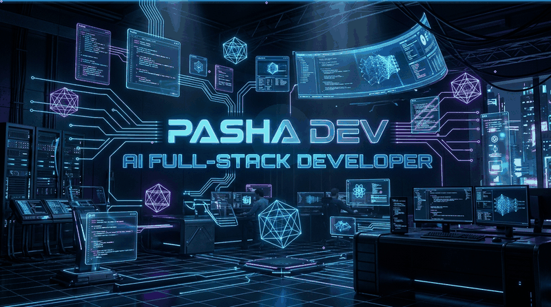

<br/>

<!-- ═══════════════════════ TERMINAL PROMPT ═══════════════════════ -->


<br/>

<!-- ═══════════════════════ BOOT SEQUENCE ═══════════════════════ -->

<br/>

<!-- ═══════════════════════ CLI TERMINAL ═══════════════════════ -->
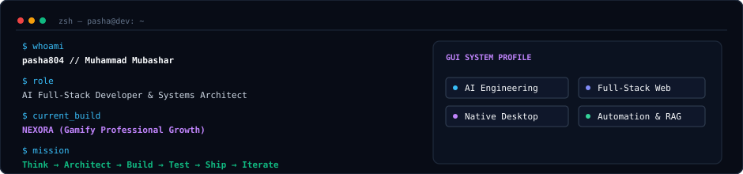

<br/><br/>

<!-- ═══════════════════════ QUICK LINKS ═══════════════════════ -->
<a href="https://pasha-portfolio-v6.netlify.app/">
  
</a>
&nbsp;
<a href="https://linkedin.com/in/pasha-dev">
  
</a>
&nbsp;
<a href="https://github.com/pasha804">
  
</a>
&nbsp;
<a href="mailto:pashadev804@gmail.com">
  
</a>

</div>

---

## 🧬 01 // IDENTITY & LIVE TELEMETRY

<table>
<tr>
<td width="68%" valign="top">

### Muhammad Mubashar — Pasha Dev
**AI Full-Stack Developer • Systems Architect • Product Engineer**

I build software systems at the convergence of **production-grade backend architecture**, **type-safe frontend engineering**, **autonomous AI tool calling**, and **cinematic user interfaces**.

> *"Architecture before abstraction. Systems before shortcuts. UX before decoration. AI as an engineering multiplier."*

**Core Engineering Disciplines:**

🤖 **AI-Native Systems & Autonomous Agents** — Autonomous workflows, tool calling, long-term contextual memory, and low-latency voice integration.

🌐 **Distributed Full-Stack Architectures** — Resilient microservice products built on React, Next.js, TypeScript, FastAPI, PostgreSQL, and Redis.

🖥️ **Native Desktop Systems & AI HUDs** — High-performance desktop companions engineered with Tauri (Rust), React, and local Python runtime cores.

🛡️ **Stealth Vision & Developer Tooling** — Real-time canvas OCR, undetectable transparent HUD overlays, and multi-model LLM reasoning engines.

⚡ **Production Shipping** — Rapid validation from idea through architecture, strict automated testing, containerized deployment, and live telemetry observability.

</td>
<td width="32%" align="center" valign="middle">

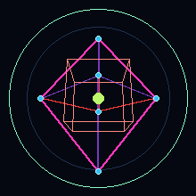

<br/>
<sub><b>3D SYSTEM CORE</b><br/><code>NEURAL MULTIPLIER</code></sub>

</td>
</tr>
</table>

<br/>

<!-- LIVE TELEMETRY METRICS — Auto-updated via GitHub Actions every 6 hours -->
<div align="center">
  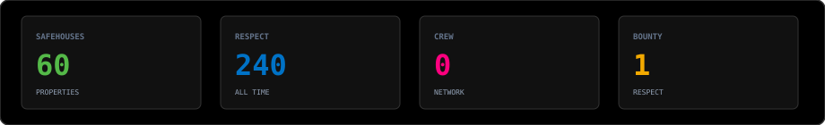
</div>

---

## ⚡ 02 // ENGINEERING DNA & PIPELINE

```text
┌─────────────────────────────────────────────────────────────────────────────┐
│ 01 / SPEC & FRICTION ANALYSIS   ──► Deconstruct user pain & latency bounds  │
│ 02 / SYSTEM & SCHEMA ARCHITECTURE ──► PostgreSQL DDL, API contracts & types  │
│ 03 / AI-ACCELERATED SYNTHESIS   ──► High-velocity builds with tool calling   │
│ 04 / RIGOROUS TYPE & LATENCY QA ──► Strict tests, memory profiles & edges   │
│ 05 / CONTAINERIZED PROD SHIP    ──► Multi-cloud CI/CD (Docker, Vercel, Rail) │
│ 06 / TELEMETRY & OBSERVABILITY  ──► Live event streams, metrics & iteration │
└─────────────────────────────────────────────────────────────────────────────┘
```

**Architectural Principles:**

* **Architecture before abstraction.** A system must survive its initial assumptions.
* **Systems before shortcuts.** Temporary hacks compound into technical paralysis.
* **UX before decoration.** Visual depth must reinforce product clarity, never obscure it.
* **AI as multiplier.** Velocity is accelerated by AI, but architectural decisions remain under human command.
* **Shipping over endless planning.** A product is purely theoretical until real users interact with it.

---

## 🛠️ 03 // TECHNOLOGY UNIVERSE

<div align="center">
  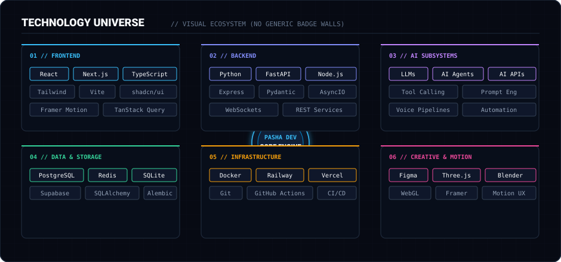
</div>

---

## 🟣 04 // CURRENT SPRINT: NEXORA (FLAGSHIP)

<div align="center">

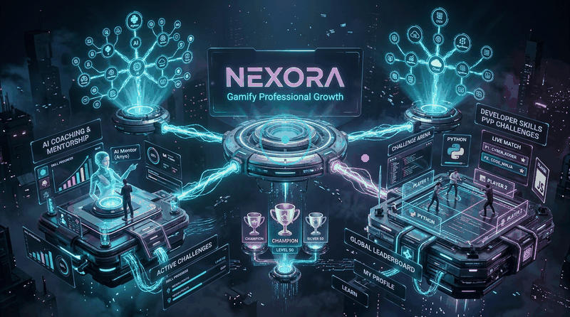

<br/>

</div>

<table>
<tr>
<td width="60%" valign="top">

### NEXORA — Gamify Professional Growth
*Learn Together • Build Together • Compete Together*

Nexora is an AI-powered skill social platform merging professional developer identity, collaborative communities, competitive peer-to-peer skill practice, and automated AI coaching.

**Architecture Highlights:**

* **Client Tier**: React + TypeScript + Vite + Tailwind CSS + shadcn/ui + Framer Motion + TanStack Query.
* **Backend API**: FastAPI Async REST & WebSocket microservices running in isolated Docker containers.
* **AI Judge & Coach**: Autonomous LLM agent judging live coding challenges, tracking skill progression curves, and delivering actionable feedback.
* **Persistence Layer**: Relational developer graph in PostgreSQL paired with in-memory Redis caching and challenge queues.

</td>
<td width="40%" valign="top">

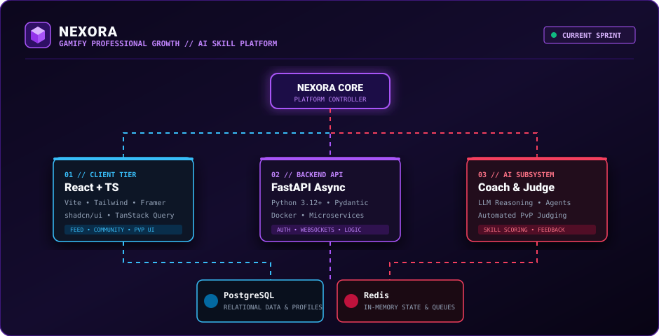

<br/>

```text
[ PROJECT ]  Nexora
[ STACK ]    React • TypeScript
             FastAPI • PostgreSQL
             Redis • Docker
             Framer Motion
[ STATUS ]   Active Development
[ ACCESS ]   Private Alpha
```

</td>
</tr>
</table>

---

## 🧪 05 // PRODUCT LAB — PRODUCTION SYSTEMS

<br/>

<!-- ─────────── ROW 1: PASHA TOOLS + WISHORA ─────────── -->

<table>
<tr>
<td width="50%" valign="top">

<div align="center">
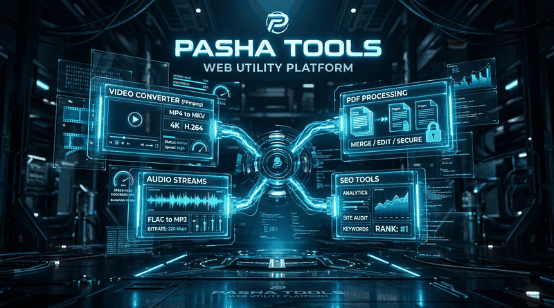
</div>

<br/>

### 🔵 [Pasha Tools](https://pashatools.com)
**Free Multi-Tool Web Platform**

A high-performance web utility suite optimized for zero-friction browser workflows:

* **Media Engine**: In-memory FFmpeg video conversions, audio extractions, and yt-dlp pipelines.
* **Document Suite**: High-speed PDF page manipulation, text parsing, and automated transforms.
* **Cloud Architecture**: Scaled across Railway (Python/FastAPI) and Vercel (React), engineered with SEO canonical routing and AdSense compliance.

<div align="center">

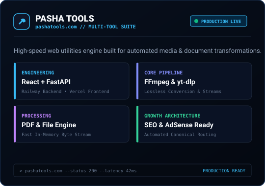

```text
[ PROJECT ]  Pasha Tools
[ STACK ]    React • FastAPI • Python • FFmpeg
[ STATUS ]   ● Production Live
[ LIVE ]     https://pashatools.com
```

</div>

</td>
<td width="50%" valign="top">

<div align="center">

</div>

<br/>

### 💜 [Wishora](https://wishora.live)
**Personalized Digital Greeting & Card Platform**

**FREE FOREVER • NO SIGNUP • INSTANT DOWNLOAD**

* **Instant Canvas Export**: Client-side canvas rendering for ultra-crisp personalized PNG greetings.
* **Fluid Experience**: Built with Next.js App Router, Tailwind CSS, and Framer Motion for smooth 60 FPS transitions.
* **Zero Barrier**: Frictionless user experience designed for maximum viral adoption.

<div align="center">

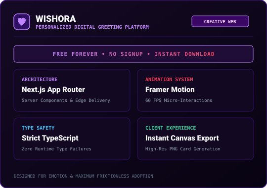

```text
[ PROJECT ]  Wishora
[ STACK ]    Next.js • TypeScript • Tailwind
             Framer Motion
[ STATUS ]   ● Production Live
[ LIVE ]     https://wishora.live
```

</div>

</td>
</tr>
</table>

<br/>

<!-- ─────────── ROW 2: ZORO 2.0 + OPENCLUELY ─────────── -->

<table>
<tr>
<td width="50%" valign="top">

<div align="center">
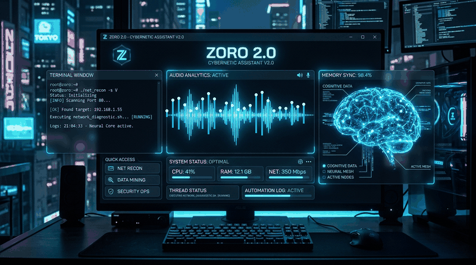
</div>

<br/>

### 🤖 Zoro 2.0
**Native Windows AI Assistant (Desktop Application)**

A native Windows AI command center running locally on the user's operating system:

* **Multi-Process Architecture**: Tauri (Rust wrapper) hosting a React HUD UI wired directly to a Python AI core.
* **Voice & Memory**: Local neural speech processing, long-term contextual memory, and automated desktop tool execution.
* **Cyberpunk Command Center**: Low-latency dark HUD designed for instant keyboard hotkey invocation.

<div align="center">

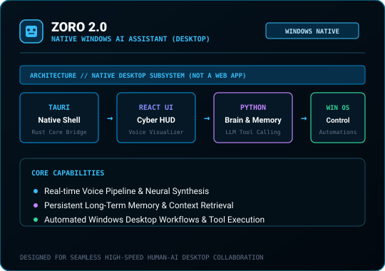

```text
[ PROJECT ]  Zoro 2.0
[ STACK ]    Tauri (Rust) • React
             Python Core • Speech Synthesis
[ STATUS ]   ● Internal Desktop Build
[ SOURCE ]   Local Windows System
```

</div>

</td>
<td width="50%" valign="top">

<div align="center">
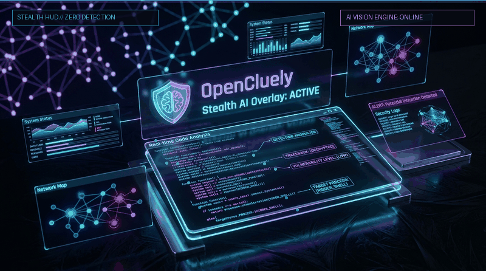
</div>

<br/>

### 🛡️ [OpenCluely](https://github.com/pasha804/OpenCluely)
**Stealth AI Interview & DSA Companion**

An open-source stealth AI overlay for live technical interviews, DSA, and OAs:

* **Stealth Transparent HUD**: Invisible frameless desktop overlay with zero screen-capture footprint and hotkey triggers.
* **Optical Screen Engine**: Real-time canvas OCR parsing problem statements and algorithmic constraints on the fly.
* **Multi-Model Intelligence**: Instant algorithmic proofs streaming optimal time/space complexity solutions (O(N) / O(log N)).

<div align="center">

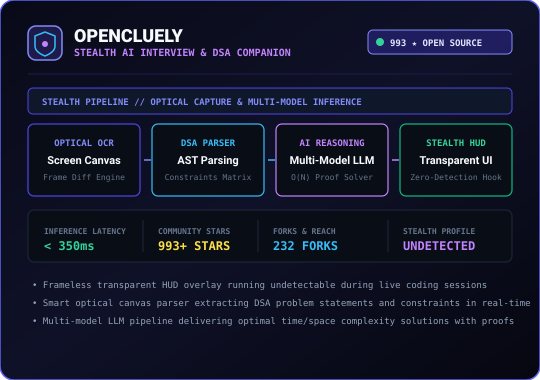

```text
[ PROJECT ]  OpenCluely
[ STACK ]    TypeScript • Electron/Tauri
             Gemini AI • Whisper • Vision OCR
[ STATUS ]   ● Active Dev // Open Source
[ REPO ]     github.com/pasha804/OpenCluely
```

</div>

</td>
</tr>
</table>

---

## 🏛️ 06 // SYSTEM ARCHITECTURE BLUEPRINT

How software systems are designed from user touchpoint to distributed storage:

<div align="center">
  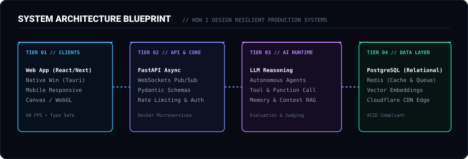
</div>

---

## 📊 07 // GITHUB COMMAND CENTER — LIVE TELEMETRY

> **All stats below are real-time data** sourced directly from the GitHub API and auto-refreshed every 6 hours via GitHub Actions CI/CD. No static fakes, no third-party services.

<div align="center">

<!-- COMMAND CENTER OVERVIEW -->
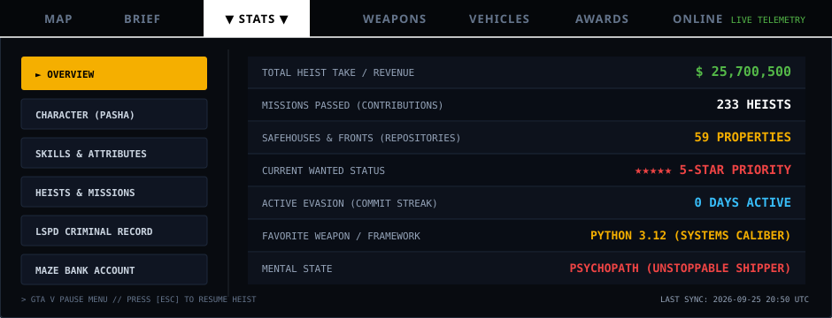

<br/><br/>

<!-- STATS + LANGUAGES SIDE BY SIDE -->
<table width="100%">
<tr>
<td width="50%" valign="top">
  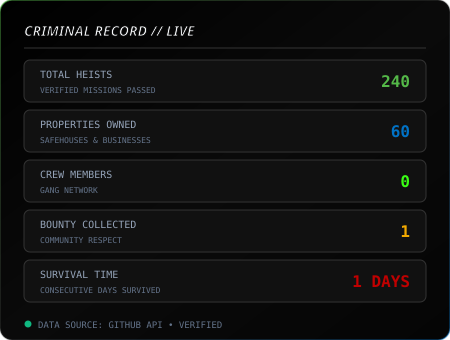
</td>
<td width="50%" valign="top">
  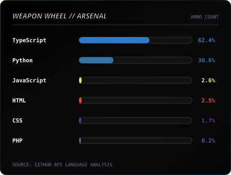
</td>
</tr>
</table>

<br/>

<!-- STREAK -->
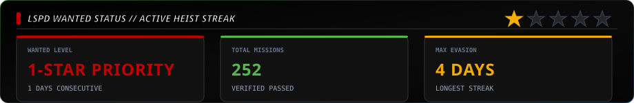

<br/><br/>

<!-- MONTHLY -->
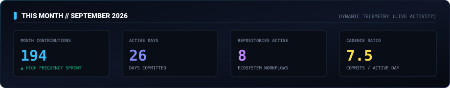

<br/><br/>

<!-- 52-WEEK CONTRIBUTION MATRIX -->
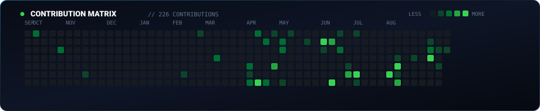

<br/><br/>

<!-- LIVE ACTIVITY LOG -->
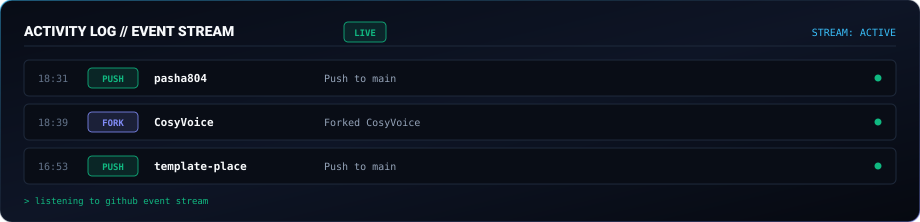

</div>

---

## ⚙️ 08 // AI × ENGINEERING WORKFLOW

I do not treat AI as a replacement for engineering fundamentals. AI is an **exponential multiplier** for research velocity, syntax generation, and exploration, while architectural boundaries, security, type safety, testing, and production deployments remain strictly under developer command.

<div align="center">
  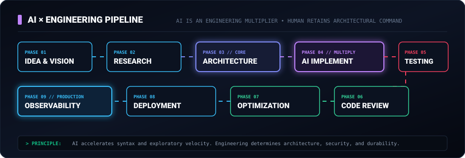
</div>

```text
IDEA ──► RESEARCH ──► ARCHITECTURE ──► AI BUILD ──► VALIDATION ──► TEST ──► SHIP ──► OBSERVE ──► ITERATE
```

---

## 🌍 09 // FROM PAKISTAN TO THE WORLD

<div align="center">
  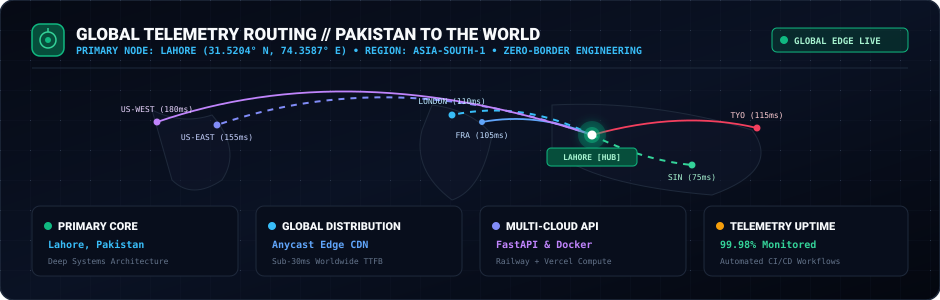
</div>

---

## 🌐 10 // CONNECT & COLLABORATE

I am always open to discussing AI-native products, scalable full-stack architecture, developer tools, and innovative engineering collaborations.

<div align="center">

<a href="https://pasha-portfolio-v6.netlify.app/">
  
</a>

<br/><br/>

<a href="https://github.com/pasha804">
  
</a>
&nbsp;
<a href="https://linkedin.com/in/pasha-dev">
  
</a>
&nbsp;
<a href="https://instagram.com/@pasha_dev_">
  
</a>
&nbsp;
<a href="https://tiktok.com/@pasha_dev_">
  
</a>
&nbsp;
<a href="https://youtube.com/@Pasha804a">
  
</a>
&nbsp;
<a href="mailto:pashadev804@gmail.com">
  
</a>

</div>

<br/>

---

<div align="center">


<br/><br/>

### **Pasha Dev**
**Muhammad Mubashar**  
*AI Full-Stack Developer • Systems Architect • Product Engineer*  
`Lahore, Pakistan // 31.5204° N, 74.3587° E`

<sub>Engineered with precision, curiosity, and an obsession with shipping durable software.</sub>

<br/>

<sub>📊 Stats are <b>LIVE</b> — refreshed every 6 hours via <a href="./.github/workflows/profile-dashboard.yml">GitHub Actions CI/CD</a> using real GitHub API data.</sub>

</div>
